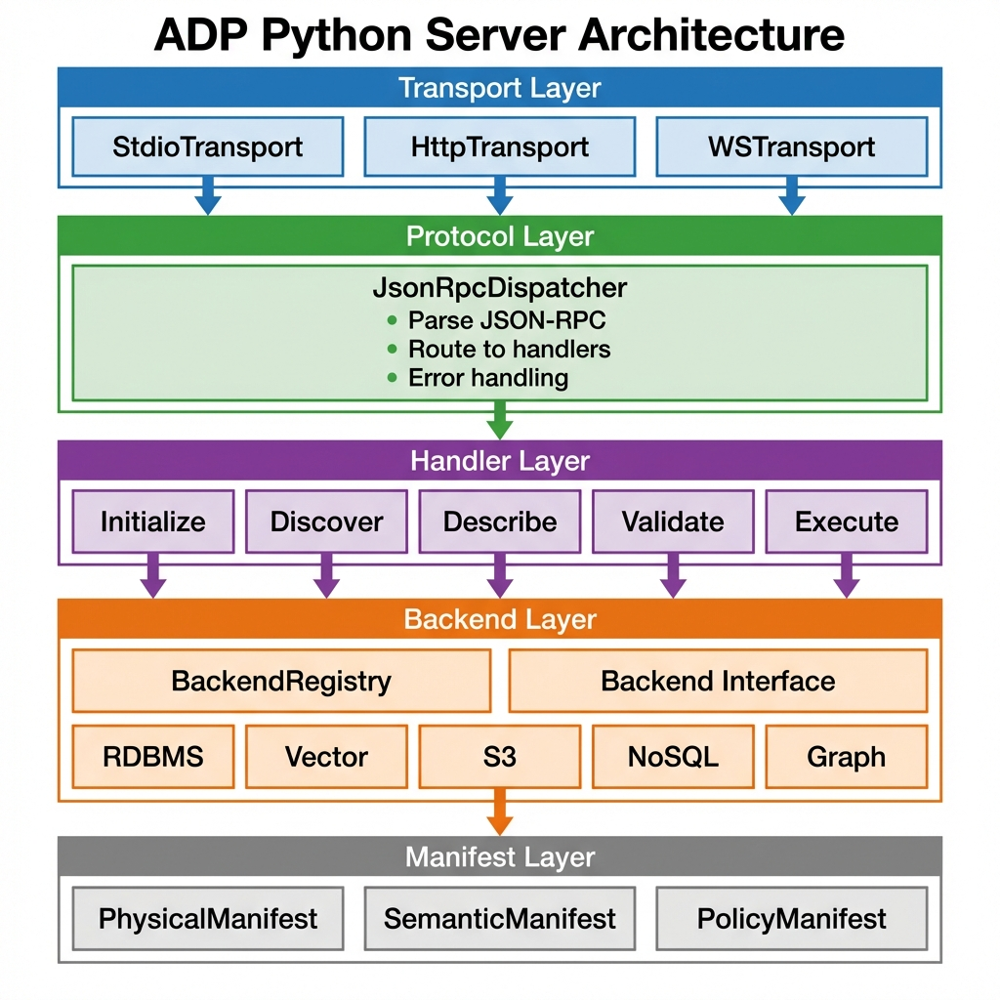
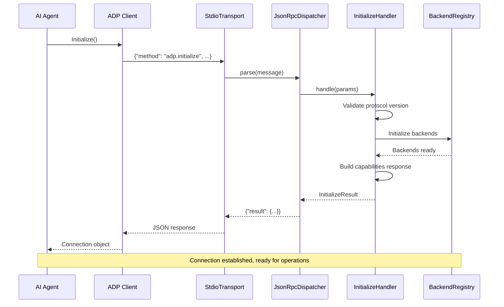
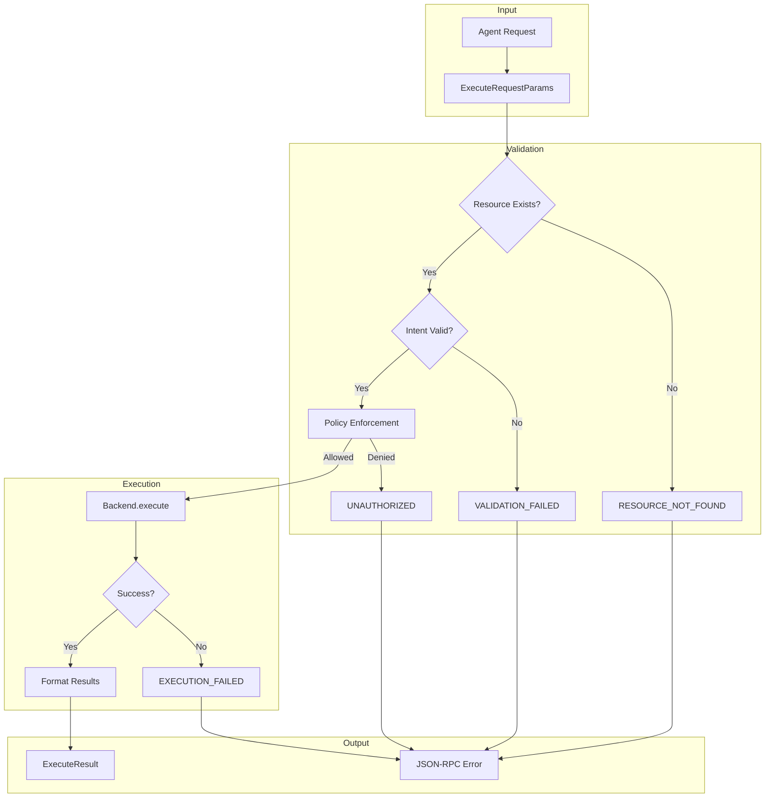
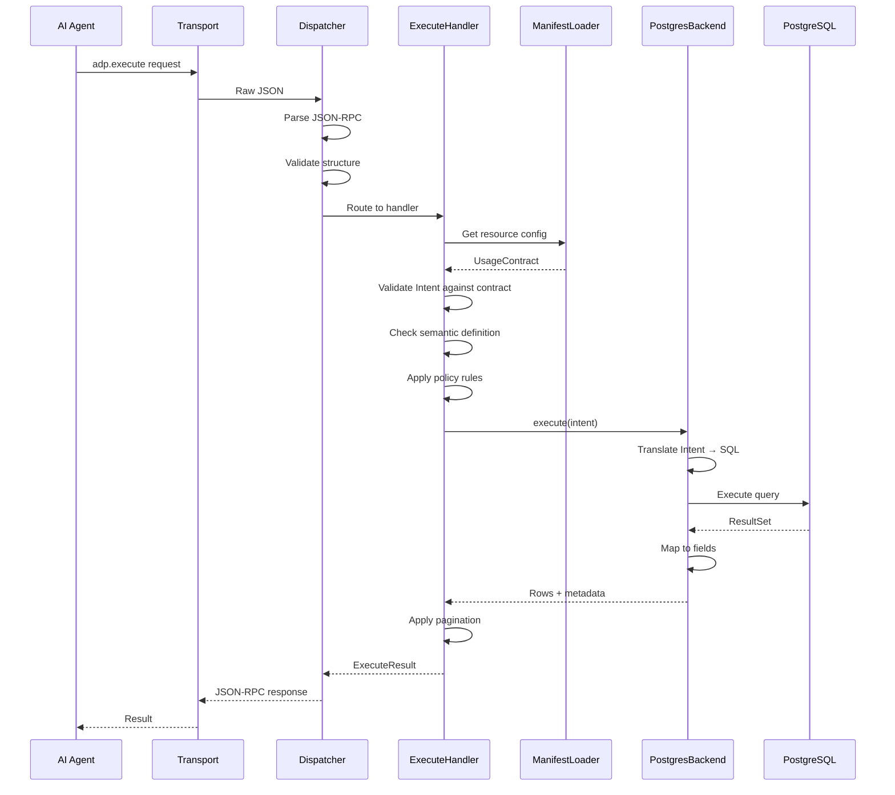
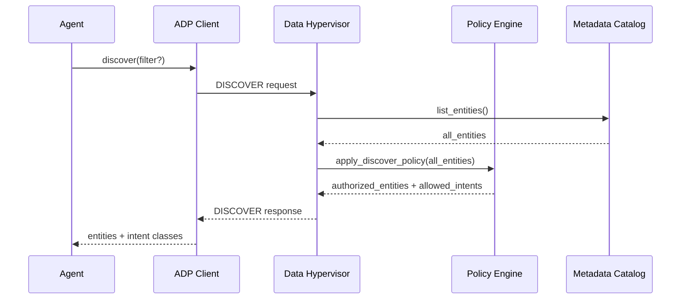
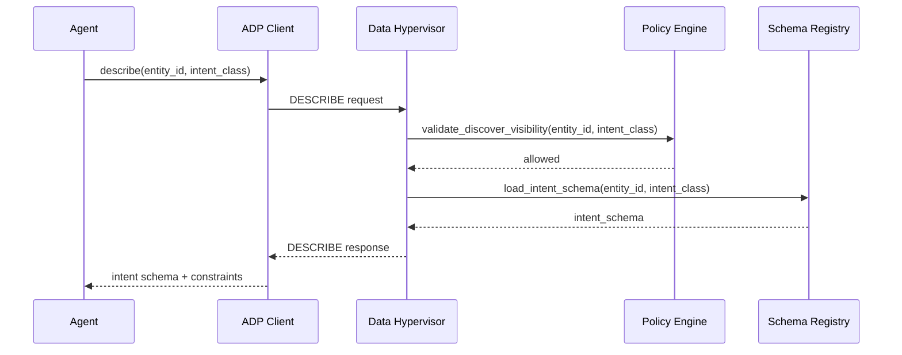
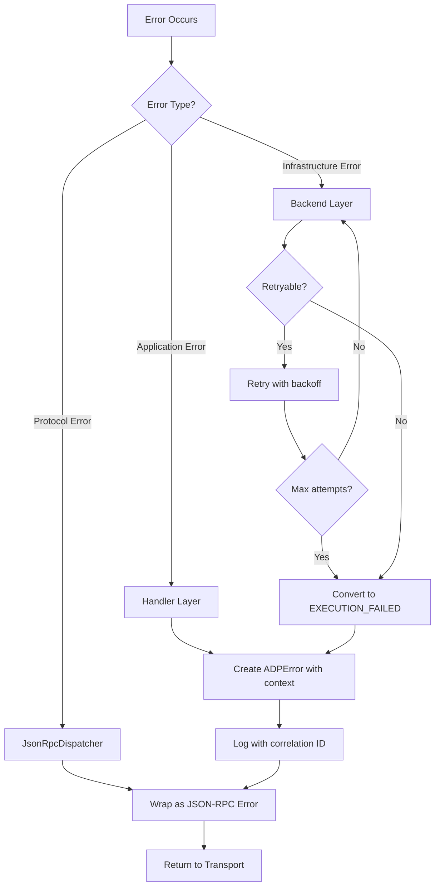

# ADP Python Server Design and Implementation

> **Version**: 2026-01-20  
> **Protocol Version**: ADP Protocol v2026-01-20  
> **Status**: Draft  
> **Authors**: ADP Team  
> **Last Updated**: 2026-01-20

---

## Table of Contents

- [Executive Summary](#executive-summary)
- [1. Overview](#1-overview)
- [2. Architecture Design](#2-architecture-design)
- [3. Project Structure](#3-project-structure)
- [4. Core Interface Definitions](#4-core-interface-definitions)
- [5. Type Definitions](#5-type-definitions-based-on-schemats)
- [6. Development Task Breakdown](#6-development-task-breakdown)
- [7. Technology Stack](#7-technology-stack)
- [8. Verification Plan](#8-verification-plan)
- [9. Risks and Mitigations](#9-risks-and-mitigations)
- [10. Error Handling Strategy](#10-error-handling-strategy)
- [11. Observability Design](#11-observability-design)
- [12. Security Considerations](#12-security-considerations)
- [13. References](#13-references)

---

## Executive Summary

### Purpose

This document defines the architecture and implementation plan for the ADP (Agentic Data Protocol) Python Server—a reference implementation that enables AI Agents to safely access heterogeneous data systems through a unified Intent-based interface.

### Key Design Decisions

| Decision          | Choice                                              | Rationale                                                         |
| :---------------- | :-------------------------------------------------- | :---------------------------------------------------------------- |
| Architecture     | Layered (Transport → Protocol → Handler → Backend)  | Clear separation of concerns; each layer can evolve independently |
| Language         | Python 3.11+                                        | Rich async ecosystem, AI/ML community adoption, rapid prototyping |
| Type System      | Pydantic v2                                         | Runtime validation, JSON Schema generation, TypeScript parity     |
| Concurrency      | async/await (asyncio)                               | Non-blocking I/O for database operations, scalable handling       |
| Package Manager  | uv                                                  | High performance, efficient dependency resolution, unified toolchain |
| Initial Transport | stdio                                               | Simplest integration path; aligns with MCP patterns               |

### Scope

**In Scope (Phase 1)**:
- Core JSON-RPC 2.0 protocol implementation
- stdio transport for local process communication
- RDBMS backend (PostgreSQL) as reference implementation
- Vector backend (LanceDB) as reference implementation - AI-native, optimized for embedding workflows
- Full support for 4 Intent types: LOOKUP, QUERY, INGEST, REVISE

**Out of Scope (Future Phases)**:
- Streamable HTTP transport
- Policy Enforcement (Enforcement Logic)
- NoSQL backends (MongoDB), Graph backends, Object Storage (S3)
- Multi-tenancy and authentication
- Distributed deployment

### Success Criteria

1. **Functional**: Pass all protocol conformance tests defined in `schema.ts` and `curation.ts`
2. **Performance**: Handle 100 concurrent Intent executions with <100ms p99 latency (excluding backend time)
3. **Quality**: >80% unit test coverage, zero critical security vulnerabilities

---

## 1. Overview

### 1.1 Background

Agentic Data Protocol (ADP) is a JSON-RPC 2.0 based protocol that enables AI Agents to safely and reproducibly access heterogeneous data systems through a unified Intent interface. Unlike direct database access or ad-hoc query generation, ADP provides:

- **Intent Abstraction**: Agents express *what* they need, not *how* to retrieve it
- **Schema Contracts**: Explicit field definitions prevent hallucinated queries
- **Policy Enforcement**: Curators control access patterns at the protocol level
- **Backend Agnosticism**: Same Intent works across PostgreSQL, MongoDB, S3, etc.

This document describes the architecture and implementation plan for the ADP Python Server—the reference implementation demonstrating these principles.

### 1.2 Core Features

Based on [schema.ts](../schema/2026-01-20/schema.ts), the server implements 6 JSON-RPC methods:

| Method           | Description                                    | Params                    | Result                   |
| :--------------- | :--------------------------------------------- | :------------------------ | :----------------------- |
| `adp.initialize` | Connection initialization, capability exchange | `InitializeRequestParams` | `InitializeResult`       |
| `adp.ping`       | Health check                                   | `RequestParams`           | `EmptyResult`            |
| `adp.discover`   | Browse available resources                     | `DiscoverRequestParams`   | `DiscoverResult`         |
| `adp.describe`   | Get usage contract for a resource              | `DescribeRequestParams`   | `DescribeResult`         |
| `adp.validate`   | Validate Intent IR                             | `ValidateRequestParams`   | `ValidateResult`         |
| `adp.execute`    | Execute Intent IR                              | `ExecuteRequestParams`    | `ExecuteResult`          |

### 1.3 Supported Backend Types

Based on [curation.ts](../schema/2026-01-20/curation.ts), 5 backend types are defined:

- **RDBMS** - Relational databases (PostgreSQL, MySQL, etc.)
- **VECTOR** - Vector databases (Pinecone, Weaviate, etc.)
- **S3** - Object storage (AWS S3, MinIO, etc.)
- **NOSQL** - NoSQL databases (MongoDB, DynamoDB, etc.)
- **GRAPH** - Graph databases (Neo4j, etc.)

### 1.4 Supported Intent Types

- **LOOKUP** - Retrieve a single entity by unique key
- **QUERY** - Retrieve entities using boolean predicates
- **INGEST** - Create or append new data
- **REVISE** - Update existing data

*Note: Intent types supported in Phase 1: LOOKUP, QUERY, INGEST, REVISE.*

---

## 2. Architecture Design

### 2.1 Layered Architecture



### 2.2 Core Component Descriptions

#### 2.2.1 Transport Layer

- **Responsibility**: Handle message sending/receiving for different transport protocols
- **Interface**: `Transport` abstract base class
- **Implementations**: 
  - `StdioTransport` (Phase 1) - Communication via stdin/stdout
  - `StreamableHttpTransport` (Phase 2) - Streamable HTTP for server-side push events (following MCP's latest direction)

#### 2.2.2 Protocol Layer (JsonRpcDispatcher)

- **Responsibilities**: 
  - Parse JSON-RPC 2.0 messages
  - Method routing
  - Error code wrapping (using error codes defined in schema.ts)
  - Response serialization

#### 2.2.3 Handler Layer

- **Responsibility**: Implement business logic for each ADP method
- **Design**: Each method corresponds to a Handler class for easy testing and maintenance

#### 2.2.4 Backend Layer

- **Responsibilities**: 
  - Unified backend abstraction interface
  - Concrete implementations for each data source type
  - Connection pooling and resource management

#### 2.2.5 Manifest Layer

- **Responsibilities**: 
  - Abstract interface for manifest operations (following curation.ts spec)
  - Load and parse configuration files
  - Runtime resource discovery and metadata management
- **Interface**: `ManifestProvider` abstract base class
- **Default Implementation**: `YamlManifestProvider` - YAML-based configuration

**When Manifests Are Used**:
- **Physical Manifest**: Used during DISCOVER to list available data sources; provides connection details for backend initialization
- **Semantic Manifest**: Used during DESCRIBE to provide entity schemas and field metadata; used during EXECUTE for intent parsing and query planning
- **Policy Manifest**: Used during DISCOVER for visibility filtering; used during EXECUTE for access control and constraint enforcement

---

### 2.3 Architecture Decision Records (ADRs)

#### ADR-001: Layered Architecture

**Context**: The server must support multiple transports, protocols, and backends while remaining maintainable.

**Decision**: Adopt a strict 5-layer architecture: Transport → Protocol → Handler → Backend → Manifest

**Rationale**:
- **Testability**: Each layer can be unit tested with mocked dependencies
- **Extensibility**: New transports/backends plug in without modifying core logic
- **Team Parallelization**: Different engineers can work on different layers simultaneously

**Trade-offs**:
- (+) Clear boundaries reduce cognitive load
- (+) Enables incremental delivery (stdio first, HTTP later)
- (-) More interfaces to maintain
- (-) Slight performance overhead from abstraction layers (acceptable for our use case)

**Alternatives Considered**:
- Monolithic handler approach: Rejected due to poor testability
- Microkernel with plugins: Overkill for current scope

---

#### ADR-002: Pydantic v2 for Type Definitions

**Context**: Need runtime type validation that aligns with TypeScript schema definitions.

**Decision**: Use Pydantic v2 for all protocol types and data models.

**Rationale**:
- **Schema Parity**: Pydantic generates JSON Schema compatible with TypeScript definitions
- **Validation**: Automatic request/response validation with detailed error messages
- **Performance**: Pydantic v2 is 5-50x faster than v1, uses Rust core
- **IDE Support**: Excellent autocomplete and type checking

**Trade-offs**:
- (+) Single source of truth for validation logic
- (+) Automatic serialization/deserialization
- (-) Learning curve for complex nested models
- (-) Slight memory overhead for model instances

---

#### ADR-003: async/await Concurrency Model

**Context**: Server must handle multiple concurrent connections and database operations efficiently.

**Decision**: Use Python's native async/await with asyncio event loop.

**Rationale**:
- **I/O Bound Workload**: Database queries are I/O bound, not CPU bound
- **Ecosystem**: asyncpg, aiomysql, and major frameworks support async
- **Scalability**: Single thread can handle thousands of concurrent connections
- **Simplicity**: Cleaner than threading or multiprocessing for our use case

**Trade-offs**:
- (+) Efficient resource utilization
- (+) Natural fit for network protocols
- (-) Requires async-compatible libraries throughout
- (-) Debugging async code can be challenging

**Considerations**:
- CPU-intensive operations (e.g., large JSON parsing) should use `asyncio.to_thread()`
- Connection pools must be async-aware

---

#### ADR-004: stdio as Primary Transport

**Context**: Need to choose initial transport for MVP that minimizes integration complexity.

**Decision**: Implement stdio transport first, following the MCP (Model Context Protocol) pattern.

**Rationale**:
- **Simplicity**: No network configuration, firewall rules, or TLS setup
- **MCP Alignment**: AI agent frameworks (Claude, etc.) already support stdio communication
- **Debugging**: Easy to test with echo/pipe commands
- **Security**: Process isolation provides inherent security boundary

**Trade-offs**:
- (+) Fastest path to working integration
- (+) Natural fit for single-tenant, local deployments
- (-) Not suitable for multi-tenant or remote access
- (-) No built-in authentication mechanism

**Migration Path**: HTTP transport in Phase 2 will share Handler and Backend layers.

---

### 2.4 Key Interaction Flows

#### 2.4.1 Connection Initialization Sequence



#### 2.4.2 Intent Execution Data Flow



#### 2.4.3 Complete Request Lifecycle



#### 2.4.4 Discover (List) Sequence



#### 2.4.5 Describe Sequence



---

## 3. Project Structure

```
adp-hypervisor/
├── pyproject.toml              # Project config and dependencies
├── README.md                   # Documentation
├── conf/                       # Configuration templates
│   ├── server.yaml.template    # Server config template
│   ├── physical.yaml.template  # Physical manifest template
│   ├── semantic.yaml.template  # Semantic manifest template
│   └── policy.yaml.template    # Policy manifest template
├── src/
│   └── adp_server/
│       ├── __init__.py
│       ├── __main__.py         # CLI entry point
│       ├── server.py           # Main server class
│       │
│       ├── transport/          # Transport layer
│       │   ├── __init__.py
│       │   ├── base.py         # Transport abstract base class
│       │   ├── stdio.py        # Stdio Transport
│       │   └── streamable_http.py  # Streamable HTTP Transport (Phase 2)
│       │
│       ├── protocol/           # Protocol layer
│       │   ├── __init__.py
│       │   ├── types.py        # Pydantic type definitions (from schema.ts)
│       │   ├── errors.py       # JSON-RPC error classes
│       │   └── dispatcher.py   # JSON-RPC dispatcher
│       │
│       ├── handlers/           # Handler layer
│       │   ├── __init__.py
│       │   ├── base.py         # Handler base class
│       │   ├── initialize.py   # adp.initialize
│       │   ├── ping.py         # adp.ping
│       │   ├── discover.py     # adp.discover
│       │   ├── describe.py     # adp.describe
│       │   ├── validate.py     # adp.validate
│       │   └── execute.py      # adp.execute
│       │
│       ├── manifest/           # Manifest layer
│       │   ├── __init__.py
│       │   ├── base.py         # ManifestProvider abstract interface
│       │   ├── yaml_provider.py  # YAML implementation (default)
│       │   ├── physical.py     # Physical Manifest model
│       │   ├── semantic.py     # Semantic Manifest model
│       │   └── policy.py       # Policy Manifest model
│       │
│       └── utils/              # Utilities
│           ├── __init__.py
│           ├── logging.py      # Logging utilities
│           └── credentials.py  # Credential management
│
├── backends/                   # Backend implementations (top-level, similar to Gravitino catalog)
│   ├── __init__.py
│   ├── base.py                 # Backend abstract base class
│   ├── registry.py             # Backend registry
│   ├── rdbms/                  # RDBMS backend
│   │   ├── __init__.py
│   │   ├── backend.py
│   │   └── postgres.py
│   ├── vector/                 # Vector backend (LanceDB)
│   │   ├── __init__.py
│   │   └── lancedb.py
│   ├── nosql/                  # NoSQL backend (MongoDB) - Future
│   │   ├── __init__.py
│   │   └── mongodb.py
│   └── graph/                  # Graph backend (Neo4j) - Future
│       ├── __init__.py
│       └── neo4j.py
│
└── tests/                      # Test directory
    ├── __init__.py
    ├── conftest.py            # pytest fixtures
    ├── unit/
    │   ├── test_protocol.py
    │   ├── test_handlers.py
    │   └── test_backends.py
    └── integration/
        └── test_server.py
```

---

## 4. Core Interface Definitions

### 4.1 Transport Abstract Interface

```python
from abc import ABC, abstractmethod
from typing import AsyncIterator

class Transport(ABC):
    """Transport layer abstract base class"""
    
    @abstractmethod
    async def start(self) -> None:
        """Start the transport"""
        pass
    
    @abstractmethod
    async def stop(self) -> None:
        """Stop the transport"""
        pass
    
    @abstractmethod
    async def receive(self) -> AsyncIterator[str]:
        """Receive messages (JSON strings)"""
        pass
    
    @abstractmethod
    async def send(self, message: str) -> None:
        """Send message (JSON string)"""
        pass
```

### 4.2 Backend Abstract Interface

```python
from abc import ABC, abstractmethod
from typing import List, Dict, Any
from .types import Intent, Field, ValidationIssue

class Backend(ABC):
    """Backend abstract base class"""
    
    @abstractmethod
    async def connect(self) -> None:
        """Establish connection"""
        pass
    
    @abstractmethod
    async def disconnect(self) -> None:
        """Close connection"""
        pass
    
    @abstractmethod
    async def get_schema(self, source: str) -> List[Field]:
        """Get schema for a data source"""
        pass
    
    @abstractmethod
    async def validate(self, source: str, intent: Intent) -> List[ValidationIssue]:
        """Validate an Intent"""
        pass
    
    @abstractmethod
    async def execute(self, source: str, intent: Intent) -> Dict[str, Any]:
        """Execute an Intent"""
        pass
```

### 4.3 Handler Abstract Interface

```python
from abc import ABC, abstractmethod
from typing import Dict, Any
from pydantic import BaseModel

class Handler(ABC):
    """Handler abstract base class"""
    
    @property
    @abstractmethod
    def method(self) -> str:
        """Return the method name this handler processes"""
        pass
    
    @abstractmethod
    async def handle(self, params: Dict[str, Any]) -> BaseModel:
        """Process request and return result"""
        pass
```

---

## 5. Type Definitions (Based on schema.ts)

Use Pydantic v2 to define all protocol types, ensuring type safety and validation:

```python
from enum import Enum
from typing import Optional, List, Dict, Any, Union
from pydantic import BaseModel, Field

# Intent Classes
class IntentClass(str, Enum):
    LOOKUP = "LOOKUP"
    QUERY = "QUERY"
    INGEST = "INGEST"
    REVISE = "REVISE"
    WILDCARD = "*"

# Predicate Operators
class PredicateOperator(str, Enum):
    EQ = "EQ"
    NEQ = "NEQ"
    GT = "GT"
    LT = "LT"
    GTE = "GTE"
    LTE = "LTE"
    CONTAINS = "CONTAINS"
    IN = "IN"
    LIKE = "LIKE"
    ILIKE = "ILIKE"
    SIMILAR = "SIMILAR"

# Field Types
class FieldType(str, Enum):
    STRING = "STRING"
    INTEGER = "INTEGER"
    FLOAT = "FLOAT"
    BOOLEAN = "BOOLEAN"
    DATE = "DATE"
    TIMESTAMP = "TIMESTAMP"
    VECTOR = "VECTOR"
    BLOB = "BLOB"
    JSON = "JSON"

# JSON-RPC Error Codes
PARSE_ERROR = -32700
INVALID_REQUEST = -32600
METHOD_NOT_FOUND = -32601
INVALID_PARAMS = -32602
INTERNAL_ERROR = -32603
RESOURCE_NOT_FOUND = -32001
VALIDATION_FAILED = -32002
UNAUTHORIZED = -32003
EXECUTION_FAILED = -32004

# See full implementation for more type definitions...
```

---

## 6. Development Task Breakdown

Tasks are broken down by PR granularity to ensure each PR is independently reviewable.

### Phase 1: Core Framework (MVP with Stdio Transport)

#### PR 1.1: Project Initialization and Base Structure
**Estimated Time**: 2-3 hours  
**Dependencies**: None

- [ ] Create `pyproject.toml` (Python 3.11+, Pydantic v2, asyncio)
- [ ] Set up project directory structure
- [ ] Add development dependencies
  - `pytest`: Testing framework
  - `black`: Code formatting
  - `ruff`: Fast linting
  - `mypy`: Static type checking
- [ ] Create basic `README.md` documentation
- [ ] Configure GitHub Actions CI

**Output Files**:
- `adp-hypervisor/pyproject.toml`
- `adp-hypervisor/src/adp_server/__init__.py`
- `adp-hypervisor/.github/workflows/ci.yml`

---

#### PR 1.2: Protocol Type Definitions
**Estimated Time**: 3-4 hours  
**Dependencies**: PR 1.1

- [ ] Create Pydantic models based on `schema.ts`
  - Base types (ResourceId, IntentClass, PredicateOperator, etc.)
  - JSON-RPC message types (Request, Response, Error)
  - Request/Response parameter types (InitializeRequestParams, DiscoverResult, etc.)
  - Intent types (LookupIntent, QueryIntent, IngestIntent, etc.)
- [ ] Create JSON-RPC error classes
- [ ] Add unit tests

**Output Files**:
- `src/adp_server/protocol/types.py`
- `src/adp_server/protocol/errors.py`
- `tests/unit/test_protocol_types.py`

---

#### PR 1.3: JSON-RPC Dispatcher
**Estimated Time**: 3-4 hours  
**Dependencies**: PR 1.2

- [ ] Implement JSON-RPC 2.0 message parsing
- [ ] Implement method routing mechanism
- [ ] Implement error handling and standard response wrapping
- [ ] Support Handler registration
- [ ] Add unit tests

**Output Files**:
- `src/adp_server/protocol/dispatcher.py`
- `tests/unit/test_dispatcher.py`

---

#### PR 1.4: Stdio Transport
**Estimated Time**: 2-3 hours  
**Dependencies**: PR 1.3

- [ ] Implement `Transport` abstract base class
- [ ] Implement `StdioTransport`
  - Async stdin reading
  - stdout writing
  - Message boundary handling (newline-delimited)
- [ ] Add unit tests

**Output Files**:
- `src/adp_server/transport/base.py`
- `src/adp_server/transport/stdio.py`
- `tests/unit/test_transport_stdio.py`

---

#### PR 1.5: Manifest Loaders
**Estimated Time**: 3-4 hours  
**Dependencies**: PR 1.2

- [ ] Create Manifest Pydantic models based on `curation.ts`
- [ ] Implement YAML loader
- [ ] Implement Physical Manifest parsing
- [ ] Implement Semantic Manifest parsing
- [ ] Implement Policy Manifest parsing
- [ ] Support Bootstrap mode
- [ ] Add unit tests (using sample files from `examples/` directory)

**Output Files**:
- `src/adp_server/manifest/loader.py`
- `src/adp_server/manifest/physical.py`
- `src/adp_server/manifest/semantic.py`
- `src/adp_server/manifest/policy.py`
- `tests/unit/test_manifest.py`

---

#### PR 1.6: Backend Abstraction Layer
**Estimated Time**: 2-3 hours  
**Dependencies**: PR 1.5

- [ ] Implement `Backend` abstract base class
- [ ] Implement `BackendRegistry`
- [ ] Implement credential management utilities (env vars, secret managers)
- [ ] Add unit tests

**Output Files**:
- `src/adp_server/backends/base.py`
- `src/adp_server/backends/registry.py`
- `src/adp_server/utils/credentials.py`
- `tests/unit/test_backend_base.py`

---

#### PR 1.7: Initialize and Ping Handlers
**Estimated Time**: 1-2 hours  
**Dependencies**: PR 1.3

- [ ] Implement `InitializeHandler`
  - Protocol version negotiation
  - Capability exchange
  - Server info response
- [ ] Implement `PingHandler`
- [ ] Add unit tests

**Output Files**:
- `src/adp_server/handlers/base.py`
- `src/adp_server/handlers/initialize.py`
- `src/adp_server/handlers/ping.py`
- `tests/unit/test_handlers_init_ping.py`

---

#### PR 1.8: Discover Handler
**Estimated Time**: 2-3 hours  
**Dependencies**: PR 1.5, PR 1.7

- [ ] Implement `DiscoverHandler`
  - Read resource list from Manifest
  - Support filter criteria (domainPrefix, intentClass, keyword)
  - Support pagination
- [ ] Add unit tests

**Output Files**:
- `src/adp_server/handlers/discover.py`
- `tests/unit/test_handlers_discover.py`

---

#### PR 1.9: Describe Handler
**Estimated Time**: 2-3 hours  
**Dependencies**: PR 1.8

- [ ] Implement `DescribeHandler`
  - Return UsageContract for a resource
  - Support version queries
  - Return field definitions and capabilities
- [ ] Add unit tests

**Output Files**:
- `src/adp_server/handlers/describe.py`
- `tests/unit/test_handlers_describe.py`

---

#### PR 1.10: RDBMS Backend (PostgreSQL)
**Estimated Time**: 4-5 hours  
**Dependencies**: PR 1.6

- [ ] Implement `RDBMSBackend` base class
- [ ] Implement `PostgresBackend`
  - Connection management (using asyncpg)
  - Auto schema discovery
  - Intent to SQL translation
  - Support all 5 Intent types
- [ ] Add unit tests (with mocks)
- [ ] Add integration tests (using testcontainers)

**Output Files**:
- `src/adp_server/backends/rdbms/__init__.py`
- `src/adp_server/backends/rdbms/backend.py`
- `src/adp_server/backends/rdbms/postgres.py`
- `tests/unit/test_backend_postgres.py`
- `tests/integration/test_backend_postgres.py`

---

#### PR 1.11: Validate Handler
**Estimated Time**: 3-4 hours  
**Dependencies**: PR 1.9, PR 1.10

- [ ] Implement `ValidateHandler`
  - Validate Intent format
  - Validate field existence
  - Validate operator validity
  - Validate required predicates
  - Return validation issues list
- [ ] Apply Policy rule validation
- [ ] Add unit tests

**Output Files**:
- `src/adp_server/handlers/validate.py`
- `tests/unit/test_handlers_validate.py`

---

#### PR 1.12: Execute Handler
**Estimated Time**: 4-5 hours  
**Dependencies**: PR 1.11

- [ ] Implement `ExecuteHandler`
  - Call backend to execute Intent
  - Handle pagination
  - Collect execution metadata
- [ ] Apply Policy rules (mandatory filters, operational limits)
- [ ] Add unit tests
- [ ] Add integration tests

**Output Files**:
- `src/adp_server/handlers/execute.py`
- `tests/unit/test_handlers_execute.py`
- `tests/integration/test_execute_postgres.py`

---

#### PR 1.13: Main Server Integration and CLI
**Estimated Time**: 2-3 hours  
**Dependencies**: All previous PRs

- [ ] Implement `ADPServer` main class
- [ ] Implement CLI entry point (`__main__.py`)
  - Support config file path argument
  - Support log level setting
  - Support transport selection
- [ ] Add end-to-end tests
- [ ] Complete README documentation

**Output Files**:
- `src/adp_server/server.py`
- `src/adp_server/__main__.py`
- `tests/integration/test_server_e2e.py`

---

#### PR 1.14: Vector Backend (LanceDB)
**Estimated Time**: 3-4 hours
**Dependencies**: PR 1.12

- [ ] Implement `VectorBackend` using LanceDB
- [ ] Support SIMILAR operator for semantic search
- [ ] Add unit tests
- [ ] Add integration tests with LanceDB

**Output Files**:
- `backends/vector/__init__.py`
- `backends/vector/lancedb.py`
- `tests/unit/test_backend_vector.py`

---

### Phase 2: Extended Backends & Transports

#### PR 2.1: Streamable HTTP Transport
**Estimated Time**: 4-5 hours  
**Dependencies**: Phase 1 complete

- [ ] Implement `StreamableHttpTransport`
  - Use FastAPI/Starlette as backend
  - POST /jsonrpc endpoint with streaming support
  - Health check endpoint
  - CORS support
- [ ] Add unit tests
- [ ] Add integration tests

**Output Files**:
- `src/adp_server/transport/streamable_http.py`
- `tests/unit/test_transport_http.py`
- `tests/integration/test_server_http.py`

---

#### PR 2.2: NoSQL Backend (MongoDB)
- [ ] Implement `MongoDBBackend`

#### PR 2.3: Graph Backend (Neo4j)
- [ ] Implement `Neo4jBackend`

---

## 7. Technology Stack

### 7.1 Core Dependencies

| Dependency | Version  | Purpose                                |
| :---------- | :------- | :------------------------------------- |
| Python     | 3.11+    | Runtime                                |
| pydantic   | ^2.0     | Data validation and type definitions   |
| asyncio    | stdlib   | Async I/O                              |
| pyyaml     | ^6.0     | YAML parsing                           |
| asyncpg    | ^0.29    | PostgreSQL async driver                |

### 7.2 HTTP Transport Dependencies

| Dependency | Version  | Purpose        |
| :---------- | :------- | :------------- |
| starlette  | ^0.36    | ASGI framework |
| uvicorn    | ^0.27    | ASGI server    |

### 7.3 Development Dependencies

| Dependency     | Version  | Purpose             |
| :-------------- | :------- | :------------------ |
| pytest         | ^8.0     | Test framework      |
| pytest-asyncio | ^0.23    | Async test support  |
| testcontainers | ^3.7     | Test containers     |
| black          | ^24.0    | Code formatting     |
| ruff           | ^0.2     | Linting             |
| mypy           | ^1.8     | Type checking       |

---

## 8. Verification Plan

### 8.1 Unit Tests

Each module has corresponding unit tests, run with pytest:

```bash
# Run all unit tests
pytest tests/unit/ -v

# Run specific module tests
pytest tests/unit/test_protocol_types.py -v
```

### 8.2 Integration Tests

Use testcontainers for integration tests with real databases:

```bash
# Requires Docker running
pytest tests/integration/ -v
```

### 8.3 End-to-End Tests

Complete flow test using Stdio transport:

```bash
# Start server and send test requests
echo '{"jsonrpc":"2.0","id":1,"method":"adp.initialize","params":{"protocolVersion":"2026-01-20","capabilities":{},"clientInfo":{"name":"test","version":"1.0"}}}' | python -m adp_server --config examples/
```

### 8.4 Manual Test Checkpoints

1. **Initialize Flow**: Verify protocol version negotiation and capability exchange
2. **Discover Flow**: Verify resource list return and filtering
3. **Describe Flow**: Verify UsageContract response format
4. **Execute Flow**: Verify PostgreSQL data queries

---

## 9. Risks and Mitigations

| Risk                        | Impact                        | Mitigation                                     |
| :-------------------------- | :---------------------------- | :--------------------------------------------- |
| Type inconsistency          | Protocol compatibility issues | Auto-generate Python types from schema.ts      |
| Backend complexity          | Delayed delivery              | Implement RDBMS first, add backends gradually  |
| Async error handling        | Difficult debugging           | Comprehensive logging and error tracing        |
| Schema drift                | Breaking changes for agents   | Semantic versioning, deprecation warnings      |
| Connection pool exhaustion  | Service degradation           | Bounded pools, health checks, circuit breakers |

---

## 10. Error Handling Strategy

### 10.1 Error Classification

ADP errors are classified into three tiers with distinct handling strategies:

| Tier     | Category              | Examples                              | Handling Strategy                        |
| :------- | :-------------------- | :------------------------------------ | :--------------------------------------- |
| **Tier 1** | Protocol Errors       | Parse error, invalid JSON-RPC         | Immediate reject, no retry               |
| **Tier 2** | Application Errors    | Resource not found, validation failed | Return structured error, agent adjusts   |
| **Tier 3** | Infrastructure Errors | DB connection lost, timeout           | Retry with backoff, circuit breaker      |

### 10.2 Error Code Mapping

```
JSON-RPC Standard Errors (Protocol Layer):
├── -32700  PARSE_ERROR        → Invalid JSON received
├── -32600  INVALID_REQUEST    → Not a valid JSON-RPC request
├── -32601  METHOD_NOT_FOUND   → Unknown method name
├── -32602  INVALID_PARAMS     → Invalid method parameters
└── -32603  INTERNAL_ERROR     → Unhandled server exception

ADP Application Errors (Handler Layer):
├── -32001  RESOURCE_NOT_FOUND → Resource ID doesn't exist
├── -32002  VALIDATION_FAILED  → Intent violates schema/policy
├── -32003  UNAUTHORIZED       → Policy denies this operation
└── -32004  EXECUTION_FAILED   → Backend execution error
```

### 10.3 Error Response Format

All errors follow the JSON-RPC 2.0 error response structure with ADP extensions:

```json
{
  "jsonrpc": "2.0",
  "id": 1,
  "error": {
    "code": -32002,
    "message": "Validation failed",
    "data": {
      "issues": [
        {
          "severity": "ERROR",
          "path": "predicates[0].field",
          "message": "Unknown field 'invalid_column'",
          "suggestion": "Did you mean 'user_id'?"
        }
      ],
      "requestId": "req-abc123",
      "timestamp": "2026-01-20T10:30:00Z"
    }
  }
}
```

### 10.4 Retry Strategy

```python
# Retry configuration for infrastructure errors
RETRY_CONFIG = {
    "max_attempts": 3,
    "initial_delay_ms": 100,
    "max_delay_ms": 5000,
    "backoff_multiplier": 2.0,
    "retryable_errors": [
        "connection_refused",
        "connection_timeout", 
        "connection_reset",
    ],
    "non_retryable_errors": [
        "authentication_failed",
        "invalid_query",
    ]
}
```

### 10.5 Error Propagation Flow



### 10.6 Error Handling Guidelines

**For Handler Implementations:**

1. **Never swallow exceptions** - Always log and propagate
2. **Add context** - Include resource ID, intent type, and user context
3. **Use specific codes** - Choose the most specific error code applicable
4. **Provide actionable messages** - Include suggestions when possible
5. **Sanitize sensitive data** - Never expose credentials or internal paths

**Example Handler Error Handling:**

```python
async def handle(self, params: ExecuteRequestParams) -> ExecuteResult:
    try:
        resource = await self.manifest.get_resource(params.resourceId)
        if not resource:
            raise ResourceNotFoundError(
                resource_id=params.resourceId,
                suggestion="Use adp.discover to list available resources"
            )
        
        validation_issues = await self.validate_intent(params.intent)
        if validation_issues:
            raise ValidationFailedError(issues=validation_issues)
        
        return await self.backend.execute(params)
        
    except BackendConnectionError as e:
        logger.error(f"Backend connection failed: {e}", extra={
            "resource_id": params.resourceId,
            "backend_type": resource.backend_type,
        })
        raise ExecutionFailedError(
            message="Database connection unavailable",
            cause=str(e),
            retryable=True
        )
```

---

## 11. Observability Design

### 11.1 Observability Principles

1. **Correlation**: Every request gets a unique `request_id` propagated through all layers
2. **Structured Logging**: JSON format for machine parsing, human-readable in dev
3. **Metrics First**: Prefer metrics over logs for performance data
4. **Minimal Overhead**: Observability should add <5% latency

### 11.2 Logging Strategy

#### Log Levels

| Level     | Usage                       | Examples                                 |
| :-------- | :-------------------------- | :--------------------------------------- |
| `ERROR`   | Failures requiring attention | DB connection lost, unhandled exception  |
| `WARNING` | Degraded but functional     | Retry succeeded, deprecated API used     |
| `INFO`    | Key lifecycle events        | Server start, request completed          |
| `DEBUG`   | Detailed troubleshooting    | SQL generated, cache hit/miss            |

#### Structured Log Format

```json
{
  "timestamp": "2026-01-20T10:30:00.123Z",
  "level": "INFO",
  "logger": "adp_server.handlers.execute",
  "message": "Intent executed successfully",
  "request_id": "req-abc123",
  "resource_id": "acme/customers",
  "intent_class": "QUERY",
  "duration_ms": 45,
  "row_count": 100,
  "backend": "postgres",
  "extra": {
    "predicate_count": 2,
    "pagination": {"limit": 100, "offset": 0}
  }
}
```

#### Logging Configuration

```python
# src/adp_server/utils/logging.py
import structlog

def configure_logging(level: str = "INFO", json_format: bool = True):
    """Configure structured logging for the ADP server."""
    
    processors = [
        structlog.contextvars.merge_contextvars,
        structlog.processors.add_log_level,
        structlog.processors.TimeStamper(fmt="iso"),
        structlog.processors.StackInfoRenderer(),
    ]
    
    if json_format:
        processors.append(structlog.processors.JSONRenderer())
    else:
        processors.append(structlog.dev.ConsoleRenderer())
    
    structlog.configure(
        processors=processors,
        wrapper_class=structlog.make_filtering_bound_logger(level),
        context_class=dict,
        logger_factory=structlog.PrintLoggerFactory(),
    )
```

### 11.3 Metrics (Future Phase)

> **Note**: Detailed metrics implementation is deferred to future phases. Basic logging will be sufficient for Phase 1.

#### Planned Key Metrics

| Metric                        | Type      | Labels            | Purpose                     |
| :---------------------------- | :-------- | :---------------- | :-------------------------- |
| `adp_requests_total`           | Counter   | method, status    | Request volume              |
| `adp_request_duration_seconds` | Histogram | method, backend   | Latency distribution       |
| `adp_active_connections`       | Gauge     | transport         | Concurrent connections      |

### 11.4 Health Checks

#### Health Check Endpoints (HTTP Transport)

```
GET /health          → Basic liveness probe (always 200 if process running)
GET /health/ready    → Readiness probe (checks backend connectivity)
GET /health/detailed → Full status with component details (admin only)
```

#### Health Check Response

```json
{
  "status": "healthy",
  "version": "1.0.0",
  "protocol_version": "2026-01-20",
  "uptime_seconds": 3600,
  "checks": {
    "manifest_loaded": {"status": "pass", "resources_count": 15},
    "postgres_pool": {"status": "pass", "active": 5, "idle": 10, "max": 20}
  }
}
```

#### Stdio Transport Health

For stdio transport, health is checked via the `adp.ping` method:

```json
// Request
{"jsonrpc": "2.0", "id": 1, "method": "adp.ping", "params": {}}

// Response (healthy)
{"jsonrpc": "2.0", "id": 1, "result": {}}
```

### 11.5 Distributed Tracing (Future)

When HTTP transport is implemented, add OpenTelemetry support:

```python
# Future: OpenTelemetry integration
from opentelemetry import trace
from opentelemetry.instrumentation.asyncpg import AsyncPGInstrumentor

tracer = trace.get_tracer("adp_server")

async def execute_with_tracing(intent: Intent):
    with tracer.start_as_current_span("execute_intent") as span:
        span.set_attribute("intent.class", intent.intent_class)
        span.set_attribute("resource.id", intent.resource_id)
        # ... execution logic
```

### 11.6 Configuration Management

#### Environment Variables

| Variable                 | Default | Description                      |
| :----------------------- | :------ | :------------------------------- |
| `ADP_LOG_LEVEL`           | `INFO`  | Logging verbosity                |
| `ADP_LOG_FORMAT`          | `json`  | Log format (`json` or `console`) |
| `ADP_METRICS_ENABLED`     | `true`  | Enable Prometheus metrics        |
| `ADP_METRICS_PORT`        | `9090`  | Metrics endpoint port            |
| `ADP_REQUEST_TIMEOUT_MS`  | `30000` | Default request timeout          |
| `ADP_MAX_CONNECTIONS`     | `100`   | Max concurrent connections       |

#### Configuration File (adp-server.yaml)

```yaml
server:
  transport: stdio  # or http
  log_level: INFO
  request_timeout_ms: 30000

backends:
  postgres:
    pool_size: 20
    pool_timeout_ms: 5000
    
observability:
  metrics:
    enabled: true
    port: 9090
  tracing:
    enabled: false
    endpoint: "http://jaeger:14268/api/traces"
```

---

## 12. Security Considerations

### 12.1 Threat Model

| Threat                    | Impact              | Mitigation                                     |
| :------------------------ | :------------------ | :--------------------------------------------- |
| SQL Injection via Intent  | Data breach         | Parameterized queries only, no interpolation   |
| Malicious manifest files  | Code execution      | YAML safe_load, no custom constructors       |
| Credential exposure       | Credential theft    | Automatic redaction of sensitive fields        |
| Denial of Service         | Service unavailable | Rate limiting, timeouts, result limits         |

### 12.2 Security Controls

1. **Input Validation**: All inputs validated through Pydantic before processing
2. **Query Parameterization**: Backend implementations MUST use parameterized queries
3. **Credential Management**: Credentials loaded from environment or secret managers, never from manifest files
4. **Audit Logging**: All execute operations logged with actor context

---

## 13. References

### Internal References

- [ADP Protocol Schema](../schema/2026-01-20/schema.ts) - Type definitions for JSON-RPC messages
- [ADP Curation Schema](../schema/2026-01-20/curation.ts) - Manifest and policy definitions
- [Example Manifests](../examples/) - Sample configuration files

### External References

- [JSON-RPC 2.0 Specification](https://www.jsonrpc.org/specification) - Protocol foundation
- [MCP Python SDK](https://github.com/modelcontextprotocol/python-sdk) - Reference implementation for similar protocol
- [Pydantic v2 Documentation](https://docs.pydantic.dev/latest/) - Type validation framework
- [asyncpg Documentation](https://magicstack.github.io/asyncpg/) - PostgreSQL async driver
- [structlog Documentation](https://www.structlog.org/) - Structured logging library

---

## Appendix A: Glossary

| Term            | Definition                                                                  |
| :-------------- | :-------------------------------------------------------------------------- |
| **ADP**         | Agentic Data Protocol - The protocol specification this server implements   |
| **Intent**      | A declarative data operation request (LOOKUP, QUERY, INGEST, REVISE, etc.)  |
| **Manifest**    | YAML configuration defining resources, schemas, and policies               |
| **Resource**    | A logical data endpoint identified by domain/name (e.g., `acme/customers`)  |
| **UsageContract**| Schema definition returned by `adp.describe`                              |
| **Backend**     | Implementation that translates Intents to specific data system operations   |
| **Curator**     | Person/team responsible for defining and maintaining Manifests             |

---

## Appendix B: Change Log

| Date       | Version | Author   | Changes                                                        |
| :--------- | :------ | :------- | :------------------------------------------------------------- |
| 2026-01-20 | 1.0     | ADP Team | Initial design document                                        |
| 2026-02-03 | 1.1     | ADP Team | Added ADRs, sequence diagrams, error handling, observability   |
| 2026-02-03 | 1.2     | ADP Team | Updated Scope (Vector/S3 to Phase 1), removed SYNTHESIZE from MVP, added ADP Client role |
| 2026-02-04 | 1.3     | ADP Team | Renamed to adp-hypervisor, replaced pgvector with LanceDB, deferred S3, updated transport to Streamable HTTP |
